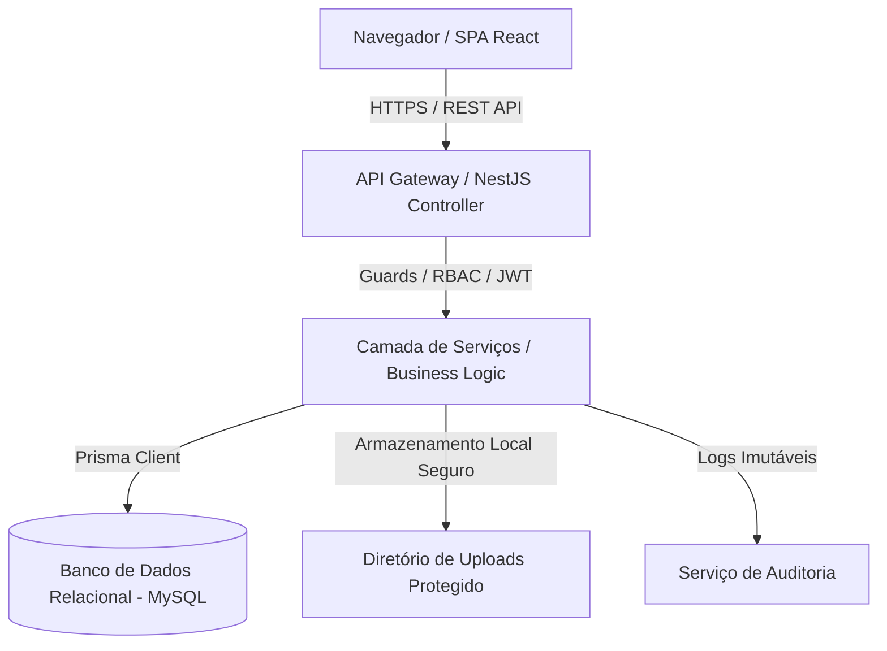
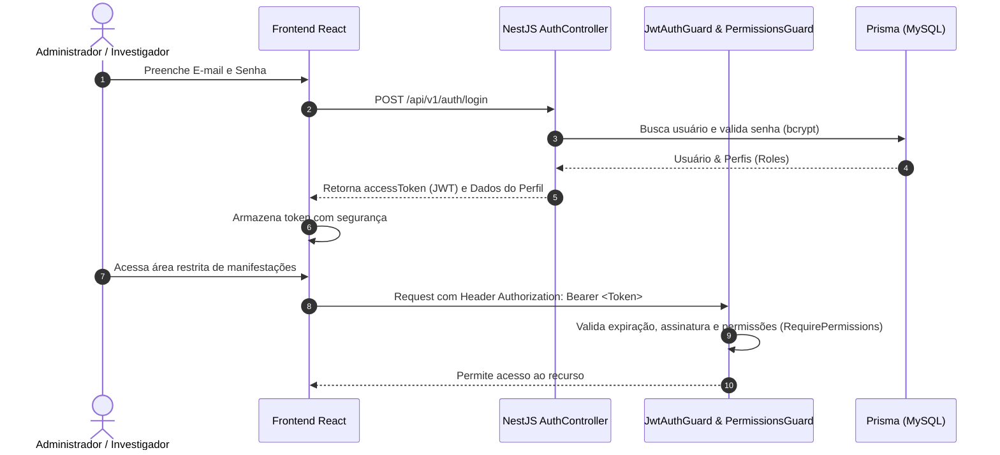
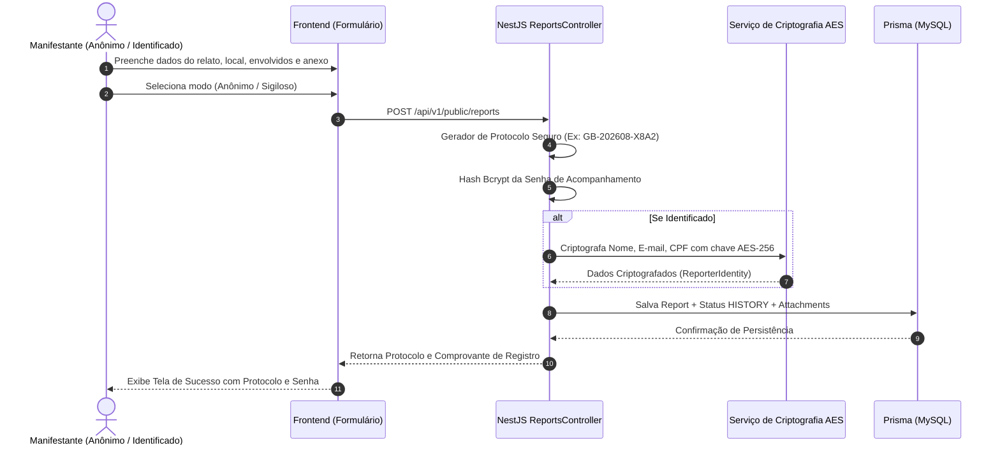
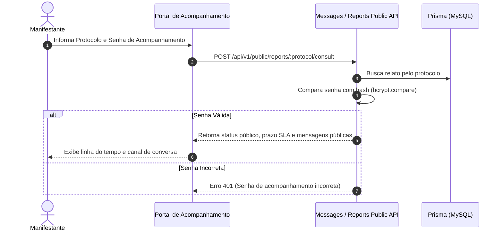
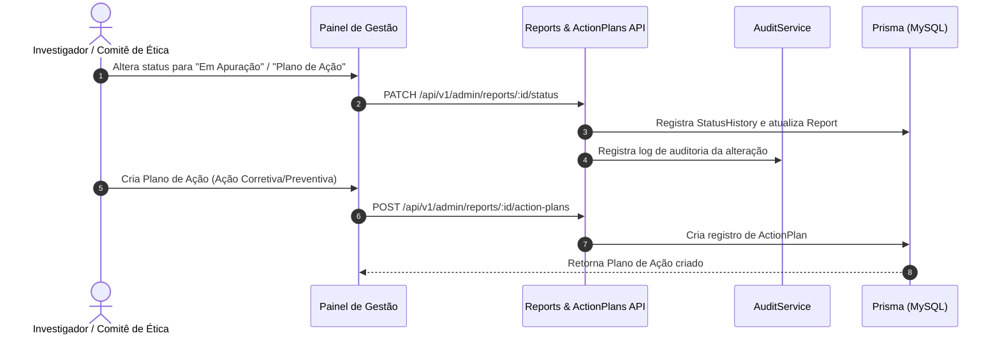
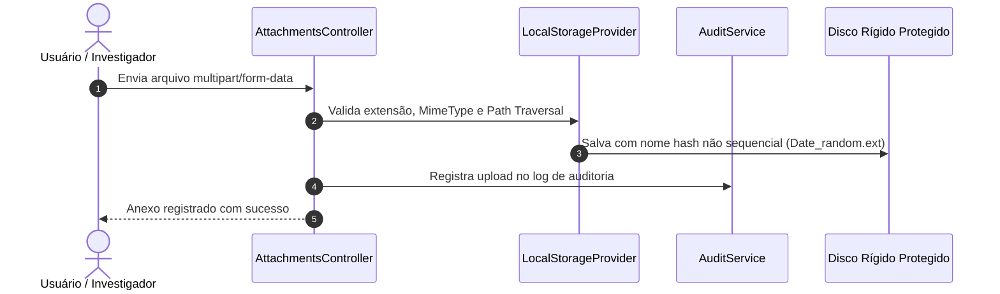
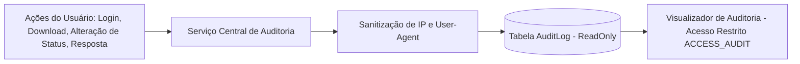

# Arquitetura do Sistema — Canal de Denúncias Grupo Bairral

Este documento detalha a arquitetura técnica, fluxo de dados e integrações da plataforma do Canal de Denúncias do Grupo Bairral.

---

## 1. Visão Geral da Arquitetura

O sistema é construído utilizando uma arquitetura em camadas desacoplada (Frontend SPA + API RESTful NestJS + Banco de Dados Relacional Prisma ORM).



---

## 2. Diagrama de Autenticação e Autorização (RBAC)



---

## 3. Diagrama de Registro de Manifestação Pública



---

## 4. Diagrama de Acompanhamento pelo Manifestante



---

## 5. Diagrama de Tratamento, Triagem e Planos de Ação



---

## 6. Diagrama de Upload e Download Seguro de Anexos



---

## 7. Diagrama de Auditoria e Governança Imutável



---

## 8. Diagrama de Implantação (Deployment)

```mermaid
graph TD
    SubGraph1[Ambiente Cloud / Docker Container]
    ClientBrowser[Navegador do Usuário] -->|Porta 3000| NginxProxy[Nginx Reverse Proxy]
    NginxProxy -->|Static Frontend Assets / SPA| ReactBuild[Dist Frontend]
    NginxProxy -->|Proxy /api/*| NestServer[NestJS Node Server - Porta 3000]
    NestServer --> DB[(MySQL / PostgreSQL Database)]
    NestServer --> UploadsDir[/uploads - Diretório Restrito]
```
